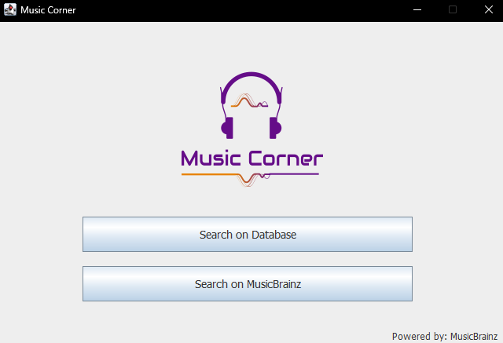
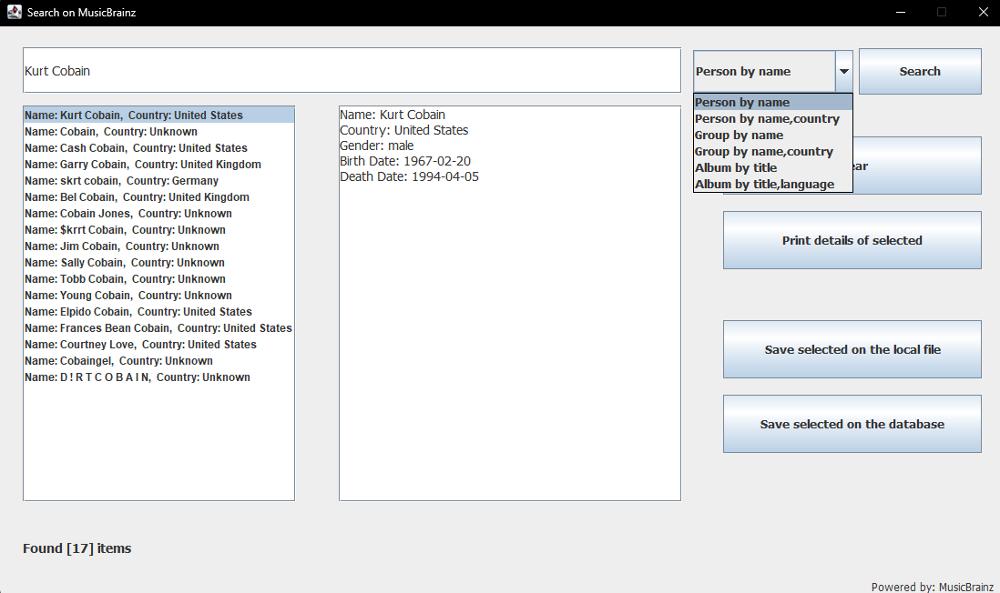
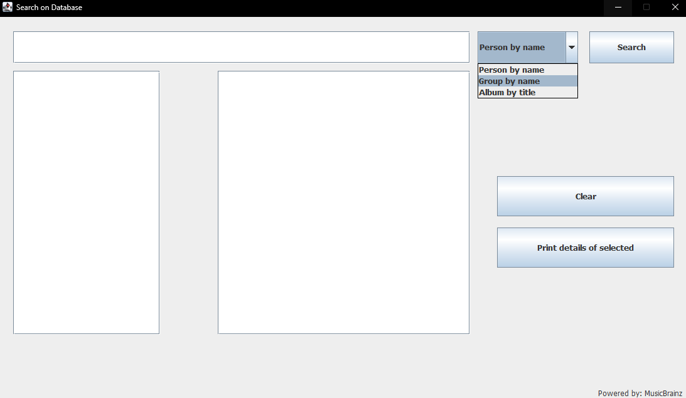

# Music Corner

**Music Corner** is a Java desktop application for searching music artists and releases through the [MusicBrainz](https://musicbrainz.org/) Web Service API.

The application lets users search MusicBrainz, inspect the returned information, and optionally persist selected results either to a **local serialized file** or to an **Oracle database**. Records stored in the database can later be searched from a separate database interface.

Music Corner was developed collaboratively as a **university project focused on learning Java and object-oriented programming (OOP)**. The project brings together inheritance, abstraction, collections, file I/O, JSON/API communication, JDBC, relational databases, and Java Swing in a complete desktop application.


## Application Preview

### Main Window

The main frame acts as the entry point to the application and provides access to the two main workflows: searching the local database or searching MusicBrainz online.



### Online MusicBrainz Search

The online search interface queries the MusicBrainz API and displays matching results alongside the details of the currently selected item.




From this window, a selected result can be:

- viewed directly in the application,
- saved to a local file, or
- saved to the Oracle database.

The available GUI search modes are:

- **Person by name**
- **Person by name and country**
- **Group by name**
- **Group by name and country**
- **Album by title**
- **Album by title and language**

### Database Search

Previously stored records can be retrieved through a separate database-search interface.



Database searches can be performed for:

- **Person by name**
- **Group by name**
- **Album by title**

The result list and the detailed view are kept separate, allowing an entry to be selected before its full information is displayed.


## Features

- Desktop GUI built with **Java Swing**.
- Search artists and releases using the **MusicBrainz Web Service API**.
- Search people and groups by name.
- Filter artist searches by country.
- Search albums by title.
- Filter album searches by language.
- Display multiple API results in a selectable list.
- Display detailed information for the selected result.
- Serialize selected results to local files.
- Store selected people, groups, and albums in an Oracle database.
- Search data that was previously saved to the database.
- Create and remove the required application database tables.
- Object-oriented model for artists, people, groups, releases, albums, and compilations.
- Demonstration classes covering the model, API/file layer, database layer, and GUI.


## Project Architecture

The source code is separated into packages according to responsibility:

```text
src/
├── basics/
│   ├── Artist.java
│   ├── Person.java
│   ├── Group.java
│   ├── Release.java
│   ├── Album.java
│   └── Compilation.java
│
├── files/
│   ├── APIWrapper.java
│   └── FileWrapper.java
│
├── db/
│   └── Database.java
│
├── db_setup/
│   ├── CreateTables.java
│   └── DropTables.java
│
├── gui/
│   ├── MainFrame.java
│   ├── MusicBrainzFrame.java
│   ├── DatabaseFrame.java
│   └── Logo.png
│
└── tests/
    ├── DemoBasics.java
    ├── DemoFilesAPI.java
    ├── DemoDatabase.java
    └── DemoGUI.java
```

This organization keeps the domain model, external data handling, persistence, and presentation layers reasonably independent from one another.


## Object-Oriented Model

The `basics` package contains the core domain objects used throughout the application.

### Artist hierarchy

```text
        Artist
       /      \
   Person    Group
```

`Artist` provides the common state and behaviour shared by artist objects. `Person` and `Group` extend it with information specific to individual musicians and musical groups.

The model can represent information such as:

- MusicBrainz artist ID
- name
- country
- city
- aliases
- tags
- gender
- birth and death dates
- group formation and end dates
- group members

### Release hierarchy

```text
       Release
       /     \
    Album  Compilation
```

`Release` represents common release information, while `Album` and `Compilation` provide specialized release types.

Release-related data includes fields such as:

- MusicBrainz release ID
- title
- status
- language
- release date
- format
- track count
- associated artist information

The model classes implement `Serializable`, allowing application objects to be persisted using Java object streams.


## MusicBrainz API Integration

Online data retrieval is handled by `APIWrapper` in the `files` package. The wrapper communicates with the MusicBrainz Web Service, processes the returned JSON, and converts it into the application's Java objects.

Important API operations include:

| Method | Purpose |
|---|---|
| `getPersonArtistsDefault()` | Search person-type artists by name |
| `getPersonArtistsFromCountry()` | Search persons and filter by country |
| `getGroupArtistsDefault()` | Search group-type artists by name |
| `getGroupArtistsFromCountry()` | Search groups and filter by country |
| `getAlbumReleasesDefault()` | Search album releases by title |
| `getAlbumReleasesFromLanguage()` | Search albums and filter by language |
| `getCompilationReleasesDefault()` | Retrieve compilation releases |
| `getCompilationReleasesFromLanguage()` | Retrieve compilations filtered by language |

The Swing interface exposes the person, group, and album search modes directly to the user.

### Example search

A standard person search can be entered as:

```text
Kurt Cobain
```

For a country-filtered person search:

```text
Kurt Cobain, United States
```

Likewise, an album can be searched by title:

```text
Bleach
```

or by title and language:

```text
Bleach, English
```

The online-search screenshot above demonstrates a person search for **Kurt Cobain**, where the application lists the MusicBrainz matches and displays the selected artist's country, gender, birth date, and death date.


## Persistence

Music Corner supports two persistence mechanisms: **local serialized files** and an **Oracle database**.

### Local Files

`FileWrapper` serializes lists of model objects with Java object streams and can later reconstruct them.

Default file names used by the project include:

```text
personArtists.txt
groupArtists.txt
albumReleases.txt
compilationReleases.txt
```

Despite the `.txt` extension, these are serialized Java object files rather than normal human-readable text files.

Example:

```java
ArrayList<Person> persons =
        APIWrapper.getPersonArtistsDefault("fred");

FileWrapper.writePersonArtistsToFile(persons);
```

The data can later be restored:

```java
ArrayList<Person> persons =
        FileWrapper.readPersonArtistsFromFile("personArtists.txt");
```

Equivalent functionality is provided for groups, albums, and compilations.

### Oracle Database

The `Database` class implements the JDBC persistence layer. It is responsible for:

- opening database connections,
- inserting individual objects,
- performing batch inserts,
- searching stored people,
- searching stored groups,
- searching stored albums,
- creating the project tables, and
- dropping the project tables.

Selected online results can be stored through the GUI using the **Save selected on the database** action.

Example database insertion calls include:

```java
Database.insertPersons(username, password, persons);
Database.insertGroups(username, password, groups);
Database.insertAlbums(username, password, albums);
```


## Database Schema

The project uses three main tables.

### `PERSON`

```text
personID
personName
personCountry
personGender
personBirthDate
personDeathDate
```

### `GROUPARTIST`

```text
groupID
groupName
groupCountry
groupBeginDate
groupEndDate
```

### `ALBUM`

```text
albumID
albumTitle
albumStatus
albumLanguage
albumReleaseDate
albumFormat
albumTrackCount
albumArtistName
```

The database representation is intentionally smaller than the full in-memory domain model. Information such as aliases, tags, cities, and group members is available in the model/API layer but is not represented by these three tables.

The project uses the Oracle JDBC driver:

```text
oracle.jdbc.driver.OracleDriver
```

and was originally configured for the university Oracle server used during development.

> [!IMPORTANT]
> The public version of the project contains dummy database connection information and credentials in the source code. Replace these values before using the database functionality.


## Application Flow

```text
                     ┌────────────────────┐
                     │    Music Corner    │
                     │     MainFrame      │
                     └─────────┬──────────┘
                               │
                 ┌─────────────┴─────────────┐
                 │                           │
                 ▼                           ▼
       ┌───────────────────┐       ┌───────────────────┐
       │ MusicBrainz Search│       │  Database Search  │
       └─────────┬─────────┘       └─────────┬─────────┘
                 │                           │
                 ▼                           ▼
       ┌───────────────────┐       ┌───────────────────┐
       │    APIWrapper     │       │     Database      │
       └─────────┬─────────┘       └───────────────────┘
                 │
                 │ JSON → Java objects
                 ▼
       ┌───────────────────┐
       │   Domain Model    │
       │ Person / Group /  │
       │ Album / etc.      │
       └──────┬──────┬─────┘
              │      │
              │      └───────────────┐
              ▼                      ▼
       ┌──────────────┐       ┌──────────────┐
       │ FileWrapper  │       │   Database   │
       │ Serialization│       │ Oracle / JDBC│
       └──────────────┘       └──────────────┘
```

This gives the user three practical options after an online search: **view the data, save it locally, or store it in the database**.


## GUI Components

### `MainFrame`

The application's starting window. It presents two actions:

- **Search on Database**
- **Search on MusicBrainz**

### `MusicBrainzFrame`

Handles online searches. It contains:

- a search input field,
- selectable search mode,
- search button,
- result list,
- detailed information view,
- clear action,
- selected-result detail action,
- save-to-file action, and
- save-to-database action.

### `DatabaseFrame`

Handles searches against locally stored database records and provides:

- a query input,
- selectable record type,
- matching record list,
- detailed record view,
- clear action, and
- selected-record detail action.


## Requirements

- **Java 8** or a compatible JDK
- Internet access for MusicBrainz searches
- Access to an Oracle database for database persistence/search functionality
- The following third-party libraries, which are **not included in the repository**:

```text
json-library.jar
json-simple-1.1.jar
ojdbc7.jar
```

These JAR files must be obtained separately and added to the project's classpath before compiling or running the application.


## Running the Project

### IDE Setup

1. Clone or download the repository.
2. Import the source code into a Java-compatible IDE.
3. Select a Java 8-compatible JDK.
4. Add the required third-party JAR files to the project classpath.
5. Run the application using the main class:

```text
gui.MainFrame
```

## Database Setup

The project contains two small setup utilities:

```text
db_setup.CreateTables
db_setup.DropTables
```

`CreateTables` creates the required `PERSON`, `GROUPARTIST`, and `ALBUM` tables, while `DropTables` removes them.


## Demonstration Classes

The `tests` package contains demonstration programs rather than a conventional automated unit-test suite.

| Class | Purpose |
|---|---|
| `DemoBasics` | Demonstrates creation and manipulation of the domain objects |
| `DemoFilesAPI` | Demonstrates MusicBrainz retrieval and serialization/deserialization |
| `DemoDatabase` | Demonstrates Oracle connection, table management, insertion, and searching |
| `DemoGUI` | Creates and displays the Swing interfaces |


## Educational Purpose

Music Corner was built primarily as a **Java/OOP learning project**. Its purpose was to combine concepts learned during a university course into a functional application rather than to serve as a production MusicBrainz client.

## Project Team

Developed collaboratively as part of a university coursework project by:

- [Giannis Dinos](https://github.com/johndinos99)
- [Marios Bairami](https://github.com/mariosbairami)
- [Fotis Karagiannis](https://github.com/fotis-karagiannis)

## Credits

Music metadata is provided by **MusicBrainz** and its contributors.

Music Corner is an independent educational project and is not affiliated with or endorsed by MusicBrainz.